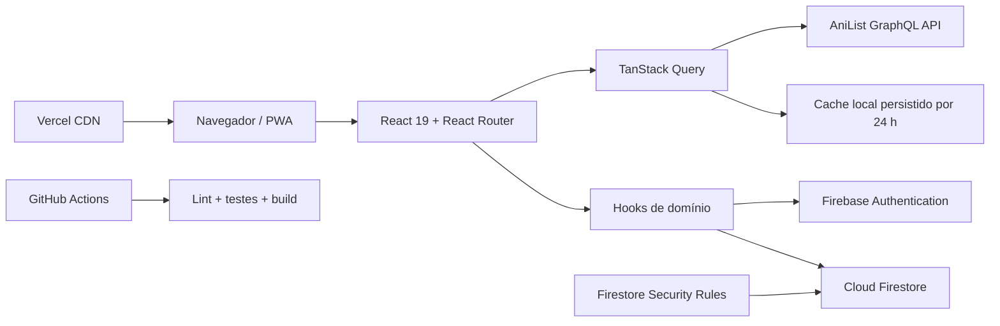

# Portal Animes V2

[](https://github.com/Tarcizioo/portal-animes-V2/actions/workflows/quality.yml)
[](LICENSE)
[](https://react.dev/)
[](https://vite.dev/)

Plataforma social para descobrir, acompanhar e organizar animes. O projeto combina
uma interface responsiva em React 19 com dados públicos da AniList, autenticação
Google, persistência em tempo real no Firebase, recursos de PWA e uma suíte de
testes automatizados.

O Portal Animes V2 foi desenvolvido como projeto de portfólio para demonstrar
arquitetura frontend, integração com APIs GraphQL, modelagem de dados, segurança,
performance, acessibilidade e experiência do usuário em uma aplicação completa.

**Aplicação:** [portal-animes-v2.vercel.app](https://portal-animes-v2.vercel.app/)

## Conteúdo

- [Funcionalidades](#funcionalidades)
- [Arquitetura](#arquitetura)
- [Modelo de dados](#modelo-de-dados)
- [Performance e experiência](#performance-e-experiência)
- [Tecnologias](#tecnologias)
- [Qualidade e testes](#qualidade-e-testes)
- [Executando localmente](#executando-localmente)
- [Configuração do Firebase](#configuração-do-firebase)
- [Deploy na Vercel](#deploy-na-vercel)
- [Custos e limites](#custos-e-limites)
- [Segurança](#segurança)

## Funcionalidades

### Descoberta e catálogo

- Home com hero rotativo, animes populares e lançamentos da temporada.
- Recomendações personalizadas a partir dos títulos presentes na biblioteca.
- Carrosséis de ação, romance, drama, terror, comédia, fantasia, ficção científica e esportes.
- Catálogo com paginação infinita e filtros persistidos por título, gênero, ano, temporada, formato, status e ordenação.
- Ação de anime aleatório para descoberta rápida.
- Busca instantânea no cabeçalho e página de busca global.
- Resultados unificados para animes, personagens, profissionais e estúdios.
- Alternância persistente entre visualização em grade e lista.
- Calendário semanal de exibição com episódio e horário previstos.

### Páginas de detalhes

- Informações completas de anime, sinopse, nota, formato, status, duração e gêneros.
- Trailer incorporado quando disponível.
- Relações de franquia, recomendações, personagens, equipe e estúdios.
- Perfis internos de personagens, profissionais e estúdios, sem retirar o usuário da plataforma.
- Dubladores organizados por idioma, incluindo português e espanhol quando disponíveis na fonte.
- Perfil de estúdio com produções, filtros por formato, ordenação e paginação infinita.
- Comentários em tempo real com curtidas e controle de autoria.

### Biblioteca pessoal

- Status `assistindo`, `completo`, `planejado`, `pausado` e `dropado`.
- Atualização rápida de episódios e status sem abrir a página do anime.
- Seção "Continue assistindo" com retomada dos títulos em andamento.
- KPIs de biblioteca, progresso conhecido e episódios assistidos.
- Pesquisa, filtros avançados, ordenação e modos de grade/lista.
- Sincronização de metadados ausentes em lotes pela AniList.
- Exportação da biblioteca em JSON e CSV.
- Importação com prévia a partir de JSON ou XML exportado pelo MyAnimeList.

### Estatísticas pessoais

- Resumo de títulos, episódios, dias estimados, média de notas e conclusão.
- Filtros combináveis por status, ano e formato.
- Distribuição por status, nota e formato.
- Análise por gênero com participação, nota média e tempo estimado.
- Insights automáticos sobre ritmo de conclusão, afinidade e perfil de avaliações.
- Ranking dos títulos mais bem avaliados pelo usuário.
- Gráficos carregados sob demanda para reduzir o bundle inicial.

### Perfil e recursos sociais

- Login com Google por meio do Firebase Authentication.
- Perfil público ou privado com nome, bio, gêneros favoritos e presença online.
- Avatar circular e banner com recorte, zoom, prévia e compressão WebP no navegador.
- Vitrine de animes, personagens e estúdios favoritos.
- Personalização das imagens dos cards com arte disponível, URL ou arquivo local.
- Reordenação por drag-and-drop dos favoritos e das seções do perfil.
- Atividade recente e mapa de contribuições.
- Sistema de conquistas com progresso, filtros e até três destaques na vitrine.
- Conexões sociais por usuário ou `@`, sem exigir que a pessoa monte URLs manualmente.
- Busca de usuários, seguidores, seguindo e remoção de seguidores.
- Relações de follow espelhadas e gravadas atomicamente no Firestore.
- Comparação entre bibliotecas por pontuação de compatibilidade.
- Compartilhamento do perfil e geração de card visual.

### Notificações e configurações

- Notificações em tempo real para visitas ao perfil, curtidas e novos seguidores.
- Preferências individuais por categoria, opção de pausar todas e ocultar lidas.
- Oito temas visuais com aplicação e persistência imediatas.
- Controles para reduzir movimento, pausar o hero automático, ocultar notas e alterar a densidade dos carrosséis.
- Central de backup e portabilidade da biblioteca.
- Exclusão de conta com reautenticação e remoção das relações e dados associados.
- Toasts animados com entrada, saída, barra de progresso e região acessível.

## Arquitetura



### Decisões principais

- A AniList é consultada diretamente por GraphQL, sem proxy próprio ou chave privada.
- As consultas solicitam apenas os campos necessários e agrupam dados relacionados quando possível.
- Requisições possuem cancelamento por `AbortController` e timeout de oito segundos.
- O TanStack Query deduplica consultas ativas, tenta novamente uma vez e persiste respostas por 24 horas.
- IDs externos são normalizados para rotas internas de anime, personagem, profissional e estúdio.
- Dados pessoais e sociais permanecem no Firebase; a AniList fornece somente metadados públicos.
- Todas as páginas são separadas por rota e carregadas com `React.lazy` e `Suspense`.
- Recharts e `html2canvas` ficam em chunks assíncronos e só são baixados quando necessários.
- O service worker pré-carrega o app shell e permite instalar a plataforma como PWA.
- A Vercel hospeda somente a SPA estática; `vercel.json` trata fallback de rotas e headers HTTP.

## Modelo de dados

| Caminho | Responsabilidade | Leitura | Escrita |
|---|---|---|---|
| `users/{uid}` | Perfil, preferências, atividade e visibilidade | Dono ou perfil público | Somente o dono |
| `users/{uid}/library/{animeId}` | Biblioteca e progresso | Dono ou perfil público | Somente o dono |
| `users/{uid}/favorite_characters/{id}` | Personagens favoritos | Dono ou perfil público | Somente o dono |
| `users/{uid}/followed_studios/{id}` | Estúdios favoritos | Dono ou perfil público | Somente o dono |
| `users/{uid}/notifications/{id}` | Central de notificações | Somente o dono | Atores autenticados criam; dono gerencia |
| `users/{uid}/following/{uid}` | Usuários seguidos | Pública | Relação atômica validada |
| `users/{uid}/followers/{uid}` | Seguidores | Pública | Relação atômica validada |
| `comments/{id}` | Comentários e curtidas | Pública | Usuários autenticados, com autoria validada |

As regras impedem alterações de identidade, payloads inesperados, notificações
forjadas e relações de follow incompletas. A exclusão de uma conta remove biblioteca,
favoritos, notificações, comentários e os dois lados das relações sociais.

## Performance e experiência

- Cache persistido de consultas para reduzir chamadas repetidas e proteger o limite da API.
- Consultas GraphQL dedicadas para home, catálogo, calendário, busca e detalhes.
- Imagens responsivas com fallback, carregamento preguiçoso e tamanhos apropriados.
- Skeletons, estados vazios, retry e mensagens específicas para falhas externas.
- Preferências de visualização salvas por página.
- Modais renderizados em portal para evitar conflitos de `z-index`.
- Suporte a teclado, Escape, bloqueio de scroll, foco visível e atributos ARIA.
- Layout adaptado para desktop, tablet e navegação móvel inferior.
- Animações respeitam a preferência de movimento reduzido.

Tamanho dos principais chunks de rota no build local atual, antes da compressão e
sem contar dependências compartilhadas:

| Chunk | Tamanho aproximado |
|---|---:|
| Perfil | 12,2 KB |
| Estatísticas | 20,6 KB |
| Estúdio | 11,9 KB |
| Recharts, assíncrono | 371,3 KB |
| `html2canvas`, assíncrono | 201,0 KB |

## Tecnologias

| Área | Tecnologia |
|---|---|
| Frontend | React 19, Vite 7 e React Router 7 |
| Estilos e animação | Tailwind CSS 3, Framer Motion e Lucide React |
| Estado do servidor | TanStack Query 5 com cache persistido |
| Dados externos | AniList GraphQL API |
| Backend | Firebase Authentication e Cloud Firestore |
| Interações | dnd-kit, Swiper e react-image-crop |
| Visualização | Recharts |
| PWA | vite-plugin-pwa e Workbox |
| Testes | Vitest, Testing Library, Node Test Runner e Firebase Emulator |
| Entrega | GitHub Actions e Vercel |

## Estrutura do projeto

```text
src/
  components/
    anime/          Seções das páginas de anime
    comments/       Comentários e interações
    home/           Hero e carrosséis da home
    layout/         Estrutura, header, sidebar e navegação móvel
    library/        Resumo, cards e retomada da biblioteca
    pages/          Páginas associadas às rotas
    profile/        Perfil, favoritos, conquistas e conexões
    settings/       Central de configurações
    stats/          Gráficos carregados sob demanda
    ui/             Componentes reutilizáveis
  context/          Autenticação e toasts
  hooks/            Estado e regras de domínio
  lib/              Configuração do TanStack Query
  services/         Firebase, AniList, busca e galeria
  utils/            Funções puras e normalizadores
tests/              Testes unitários, de componentes e regras
.github/workflows/  Pipeline de qualidade
```

## Qualidade e testes

O workflow `quality.yml` é executado em todo push e pull request:

1. Instalação reproduzível com `npm ci`.
2. Análise completa com ESLint.
3. Testes unitários e de componentes com Vitest.
4. Build de produção e geração da PWA.
5. Testes das regras no Firestore Emulator com Java 21.

Estado verificado atualmente:

- `16` arquivos e `40` testes Vitest aprovados.
- `7` testes de integração das Firestore Security Rules aprovados.
- Lint sem erros.
- Build de produção concluído com Vite 7.

Os testes cobrem mapeamento AniList, catálogo, calendário, estúdios, galeria,
deduplicação, cálculos de biblioteca, imagens favoritas, conexões,
conquistas, busca de usuários, toasts e regras de segurança.

## Executando localmente

### Requisitos

- Node.js 22 ou superior.
- npm.
- Um projeto Firebase.
- Java 21 somente para os testes das regras.

```bash
git clone https://github.com/Tarcizioo/portal-animes-V2.git
cd portal-animes-V2
npm install
```

Crie o arquivo local de ambiente.

Linux ou macOS:

```bash
cp .env.example .env.local
```

PowerShell:

```powershell
Copy-Item .env.example .env.local
```

Preencha `.env.local` com a configuração web do Firebase:

```env
VITE_FIREBASE_API_KEY=your_api_key
VITE_FIREBASE_AUTH_DOMAIN=your_project.firebaseapp.com
VITE_FIREBASE_PROJECT_ID=your_project_id
VITE_FIREBASE_STORAGE_BUCKET=your_storage_bucket
VITE_FIREBASE_MESSAGING_SENDER_ID=your_sender_id
VITE_FIREBASE_APP_ID=your_app_id
VITE_FIREBASE_MEASUREMENT_ID=your_measurement_id
VITE_ENABLE_SPEED_INSIGHTS=false
```

Inicie o ambiente:

```bash
npm run dev
```

Os valores da configuração web identificam o projeto Firebase e não são segredos de
servidor. O acesso aos dados é protegido por autenticação e pelas regras do Firestore.
Nunca adicione credenciais de service account, chaves privadas ou `.env.local` ao Git.

## Configuração do Firebase

1. Crie um projeto no [Firebase Console](https://console.firebase.google.com/).
2. Registre uma aplicação Web e copie a configuração para `.env.local`.
3. Ative o provedor Google em **Authentication > Sign-in method**.
4. Crie um banco Cloud Firestore.
5. Adicione `localhost` e o domínio da Vercel aos domínios autorizados do Authentication.
6. Publique as regras versionadas no repositório.

```bash
firebase deploy --only firestore:rules
```

O fluxo atual de avatar e banner faz recorte e compressão no navegador e não depende
do Cloud Storage for Firebase.

## Comandos

| Comando | Finalidade |
|---|---|
| `npm run dev` | Iniciar o servidor Vite |
| `npm run build` | Gerar o build de produção e a PWA |
| `npm run preview` | Visualizar o build localmente |
| `npm run lint` | Executar o ESLint |
| `npm test` | Executar os testes Vitest uma vez |
| `npm run test:watch` | Executar Vitest em modo interativo |
| `npm run test:rules` | Executar testes contra um emulador Firestore ativo |

Para iniciar o emulador e testar as regras em um único comando:

```bash
npx --yes firebase-tools@15.8.0 emulators:exec --only firestore "npm run test:rules"
```

## Deploy na Vercel

1. Importe o repositório na Vercel.
2. Configure as variáveis `VITE_FIREBASE_*` em **Project Settings > Environment Variables**.
3. Use `npm run build` como build command e `dist` como output directory.
4. Adicione o domínio final aos domínios autorizados do Firebase Authentication.
5. Mantenha `VITE_ENABLE_SPEED_INSIGHTS=false` ou ative conscientemente o recurso.

O fallback da SPA e os headers de segurança já estão definidos em `vercel.json`.
Nenhuma função serverless ou proxy de API é necessária na arquitetura atual.

## Custos e limites

O projeto foi estruturado para uso pessoal e não comercial sem mensalidade
obrigatória, desde que permaneça dentro das cotas gratuitas de cada serviço:

- A [AniList disponibiliza uma API pública gratuita](https://docs.anilist.co/guide/introduction) e não exige autenticação para dados públicos.
- A API possui [limites por minuto e proteção contra rajadas](https://docs.anilist.co/guide/rate-limiting); por isso a aplicação usa cache persistido e consultas agrupadas.
- Firebase Authentication com Google e uma base Firestore podem operar no plano Spark dentro das [cotas sem custo](https://firebase.google.com/docs/projects/billing/firebase-pricing-plans).
- A Vercel oferece o plano [Hobby de US$ 0 por mês](https://vercel.com/pricing) para projetos pessoais e não comerciais, sujeito aos limites de uso.
- O repositório público utiliza ferramentas open source e o workflow do GitHub Actions.

> **Importante:** desde 3 de fevereiro de 2026, o Cloud Storage for Firebase exige o
> plano Blaze, embora ainda possua faixas de uso sem custo. O fluxo atual não usa
> Cloud Storage; se essa arquitetura mudar, revise a
> [documentação oficial](https://firebase.google.com/docs/storage/faqs-storage-changes-announced-sept-2024)
> antes de ativar faturamento.

## Segurança

- `.env`, `.env.local`, builds, logs, dependências e arquivos locais do Codex são ignorados pelo Git.
- As regras validam dono, tipos, tamanhos, campos permitidos e timestamps do servidor.
- Comentários preservam autoria e permitem apenas alterações controladas de conteúdo ou curtida.
- Notificações validam ator, destinatário, tipo, conteúdo e rota interna.
- Follow e unfollow exigem atualização atômica dos documentos espelhados.
- Estúdios favoritos aceitam somente o payload interno necessário e rejeitam URLs externas.
- A troca de usuário não reaproveita snapshots da sessão anterior.
- A exclusão da conta exige login recente e limpa os dados relacionados.
- A Vercel aplica headers de conteúdo, frame, referrer e Content Security Policy.
- O projeto nunca utiliza credenciais administrativas do Firebase no navegador.

## Limitações conhecidas

- Dados novos dependem da disponibilidade e dos limites da AniList.
- Alguns títulos, imagens, dublagens ou traduções podem não existir na fonte pública.
- A PWA mantém o app shell e consultas persistidas, mas conteúdo ainda não armazenado exige conexão.
- O plano Vercel Hobby é destinado a projetos pessoais e não comerciais.

Este projeto não é afiliado à AniList, MyAnimeList, Firebase ou Vercel. Marcas,
imagens e metadados pertencem aos respectivos detentores.

## Licença

Distribuído sob a [licença MIT](LICENSE).

Criado por [Tarcizio](https://github.com/Tarcizioo).
