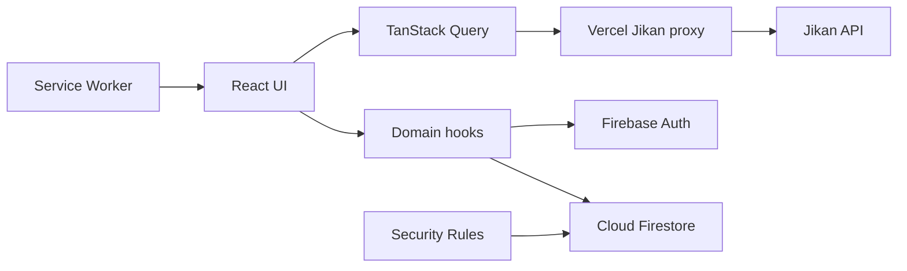

# Portal Animes V2

[](https://github.com/Tarcizioo/portal-animes-V2/actions/workflows/quality.yml)
[](LICENSE)
[](https://react.dev/)

A full-stack anime discovery, tracking, and social platform built with React 19,
Firebase, and the Jikan API. The project demonstrates real-time data modeling,
authentication, responsive interface design, API resilience, automated testing,
security rules, and production deployment on Vercel.

**Live application:** [portal-animes-v2.vercel.app](https://portal-animes-v2.vercel.app/)

## Product Highlights

- Track anime with watching, completed, paused, dropped, and planned statuses.
- Update episode progress directly from the library and set a weekly goal.
- Continue watching recent titles without opening the details page.
- Create a public profile with favorites, achievements, activity history, and social links.
- Follow other users with mirrored, atomic Firestore relationships.
- Compare libraries through a taste compatibility score.
- Explore anime, characters, people, studios, seasonal releases, and weekly schedules.
- Analyze personal viewing habits with status, score, format, and genre charts.
- Import and export library data in JSON, CSV, and MyAnimeList XML formats.
- Install the application as a PWA with runtime API and image caching.

## Engineering Highlights

### Resilient API Access

All Jikan requests use the same `/api/jikan` route in development and production.
The client applies request deduplication, a global queue, abort support, retries, and
cooldowns for HTTP 429 responses. The Vercel function adds endpoint-specific CDN
caching with stale-while-revalidate, reducing upstream traffic without a paid API.

### Real-Time and Secure Data

Firebase Authentication provides Google sign-in, while Firestore listeners keep
profiles, libraries, comments, notifications, followers, and preferences synchronized.
Listener state is associated with the active user ID so data from a previous session is
never rendered while accounts change.

Follower and following documents must be written or deleted together. These invariants
are enforced by Firestore Security Rules and verified against the local emulator.

### Performance

- Every route is lazy-loaded with React `Suspense`.
- Profile editing, sharing, compatibility, `html2canvas`, and Recharts load on demand.
- TanStack Query persists reusable API responses between sessions.
- Responsive images use appropriate sizes and lazy loading.
- The service worker removes outdated caches and uses dedicated API/image strategies.

Measured production bundle improvements:

| Route | Before | Current initial chunk | Reduction |
|---|---:|---:|---:|
| Profile | ~262 KB | ~17 KB | ~93% |
| Statistics | ~390 KB | ~23 KB | ~94% |

The large chart and image-export libraries remain in separate asynchronous chunks.

### User Experience

- Responsive grid and list layouts for desktop and mobile.
- Accessible mobile filter dialogs with Escape handling and scroll locking.
- Skeleton, empty, error, and retry states for asynchronous screens.
- Animated toast notifications with accessible live regions and exit transitions.
- Optimistic drag-and-drop ordering without copying stale objects into component state.
- Eight persistent visual themes.

## Architecture



```text
src/
  components/    Pages and reusable UI organized by domain
  context/       Authentication, theme, and toast providers
  hooks/         Firestore subscriptions and domain behavior
  services/      Firebase setup, API client, and notifications
  utils/         Pure reusable business logic
api/
  jikan/         Cached Vercel proxy for the Jikan API
tests/           Vitest component tests and Firestore rule tests
```

## Technology Stack

| Area | Technology |
|---|---|
| Frontend | React 19, Vite 7, React Router 7 |
| Styling and motion | Tailwind CSS 3, Framer Motion, Lucide React |
| Server state | TanStack Query 5 with persisted cache |
| Backend | Firebase Authentication and Cloud Firestore |
| External data | Jikan API v4 through a Vercel Function |
| Data visualization | Recharts |
| Interaction | dnd-kit, Swiper, react-image-crop |
| Offline support | vite-plugin-pwa and Workbox |
| Testing | Vitest, Testing Library, Node Test Runner, Firebase Emulator |
| Delivery | GitHub Actions and Vercel |

## Quality and Tests

The quality workflow runs on every push and pull request:

1. Install dependencies with `npm ci`.
2. Run the complete ESLint configuration.
3. Run utility and React component tests with Vitest.
4. Generate the production build.
5. Start the Firestore Emulator and verify security rules.

Current local verification:

- 9 Vitest tests covering weekly goals, library quick actions, toast behavior, and API result deduplication.
- 4 Firestore Security Rules integration tests.
- 0 ESLint errors or warnings.
- 0 known npm audit vulnerabilities.

## Run Locally

Requirements:

- Node.js 22 or newer.
- A Firebase project on the free Spark plan.
- Java 21 only when running Firestore rule tests.

```bash
npm install
cp .env.example .env.local
npm run dev
```

Fill `.env.local` with the public web configuration from Firebase Console:

```env
VITE_FIREBASE_API_KEY=your_api_key
VITE_FIREBASE_AUTH_DOMAIN=your_project.firebaseapp.com
VITE_FIREBASE_PROJECT_ID=your_project_id
VITE_FIREBASE_STORAGE_BUCKET=your_storage_bucket
VITE_FIREBASE_MESSAGING_SENDER_ID=your_sender_id
VITE_FIREBASE_APP_ID=your_app_id
VITE_FIREBASE_MEASUREMENT_ID=your_measurement_id
VITE_ENABLE_SPEED_INSIGHTS=false
```

Firebase web configuration values identify the project and are not server secrets.
Access control is enforced by Authentication and `firestore.rules`. Never commit
service-account credentials or private server keys.

## Commands

| Command | Purpose |
|---|---|
| `npm run dev` | Start the Vite development server |
| `npm run build` | Generate the production build and PWA |
| `npm run preview` | Preview the production build locally |
| `npm run lint` | Run the complete ESLint suite |
| `npm test` | Run all Vitest tests once |
| `npm run test:watch` | Run Vitest in watch mode |
| `npm run test:rules` | Run rules tests inside an active Firestore Emulator |

To start the emulator and execute its tests in one command:

```bash
npx firebase-tools emulators:exec --only firestore "npm run test:rules"
```

## Free-Tier Design

The project is designed to run without paid services:

- Jikan is a free, unauthenticated MyAnimeList API.
- Firebase uses the Spark plan and client-side Security Rules.
- Vercel hosting and the API proxy fit the free hobby workflow.
- Analytics are optional and disabled unless explicitly enabled.
- Tests and CI use open-source tools and GitHub Actions.

## Security

- Users can only modify their own profile and nested private data.
- Public profile and library reads respect each profile's visibility settings.
- Comment authorship and notification ownership are enforced server-side.
- Follow relationships require atomic mirrored writes and deletes.
- Vercel applies content type, frame, referrer, and content security headers.

## License

Released under the [MIT License](LICENSE).

Created by [Tarcizio](https://github.com/Tarcizioo).